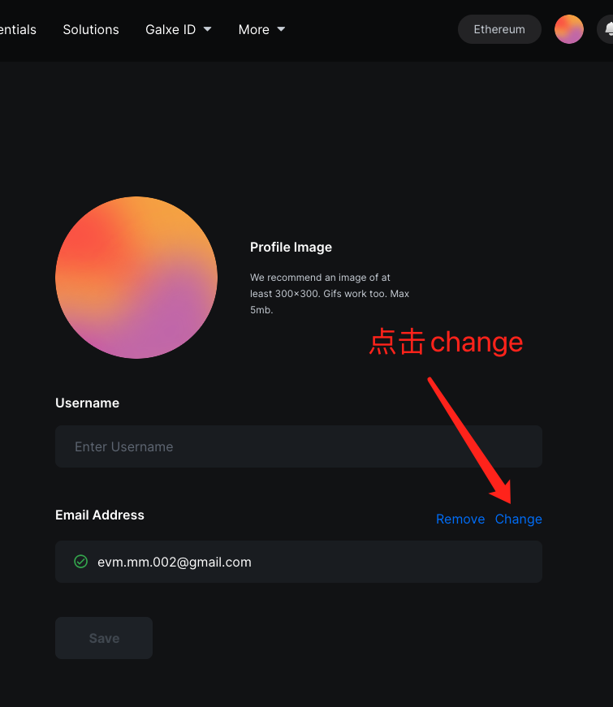
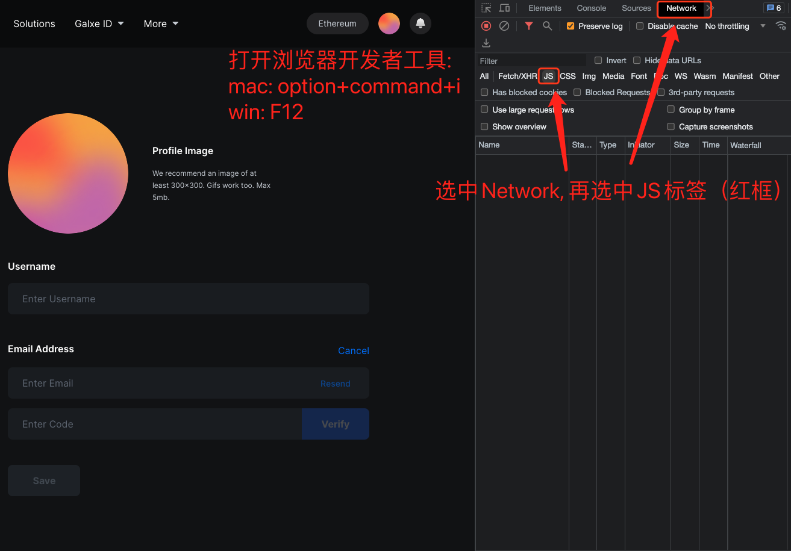
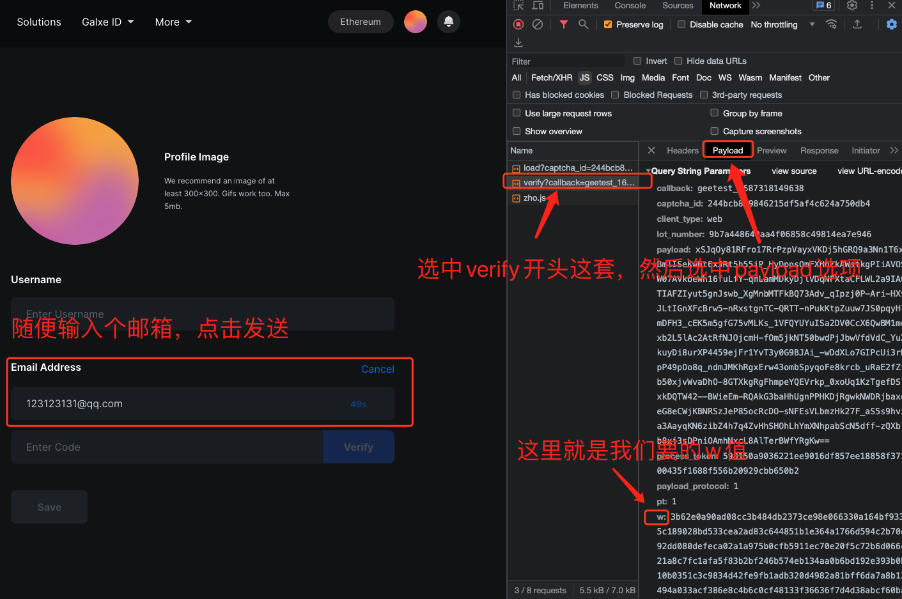

# Linea 第九周

## 🤲 拜托

- 🥹 关注本人推特 [@0x3lang](https://twitter.com/0x3lang)，会不定期开源脚本 

> 请自行检查代码，和项目依赖，风险自担，可以自行修改。

## 环境

- Nodejs [lts](https://nodejs.org/en/download), 👉[教程戳这里](https://www.liaoxuefeng.com/wiki/1022910821149312/1023025597810528)

## 安装依赖

```bash
npm i -g pnpm
pnpm install # 安装依赖
```

## 配置变量

调整 `config.ts` 文件配置:

- campaignId: 例如 https://galxe.com/Linea/campaign/GCw91UQDkQ, campaignId就是 `GCw91UQDkQ`

- w: geetest验证参数，运行前记得更新(一天一次即可)，获取方式见下图

### 获取w参数

打开个人设置页面 https://galxe.com/accountSetting?tab=Account




## 运行

`keys.txt` 放私钥，一行一个

### 转推任务

- 前置条件 **银河账号绑定twitter**

```bash
pnpm task -a retweet
```

### Snapshot 投票任务

```bash
pnpm task -a vote
```

### claim分数

```bash
pnpm task -a claim
```

#### 并发

支持并发运行，例如：

```bash
pnpm task -a claim -b 10 # 例如100个私钥，分十份并发跑，节省时间，但是会降低容错
```
